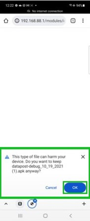
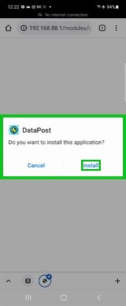

.. _installDataPost:

How install DataPost
====================

Following the steps in this guide will teach you to install the DataPost Application to your Android Device

*************
Prerequisites

To accomplish this task, you will need:

* Android Device (Android 9.x or newer)
* RACHEL-Plus Device (RACHEL OS Version 3.1.1 or Higher) with DataPost sticker
OR

* Access to the Internet

To use DataPost, follow these steps:

1. On your Android Phone, download the DataPost App from the RACHEL Device or from this link (http://community.worldpossible.org/t/latest-android-apk-file/1646)
2. If prompted to keep the download, Select OK.

3. When Prompted to Install the DataPost Application to the Device, Select Install

4. The DataPost App will now be installed and ready to help you transport RACHEL data to and from offline sites that host a RACHEL device
