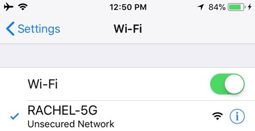
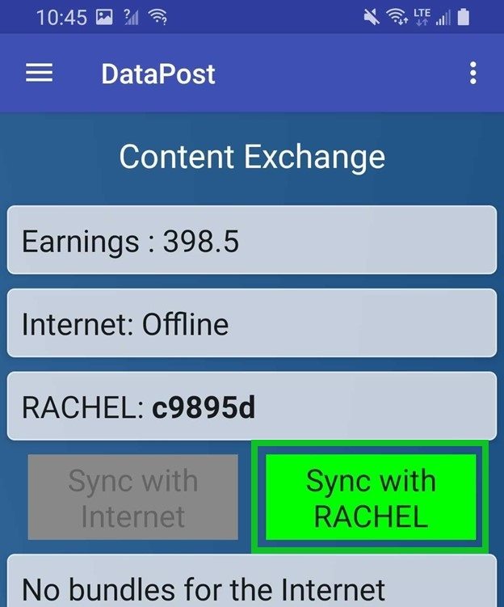
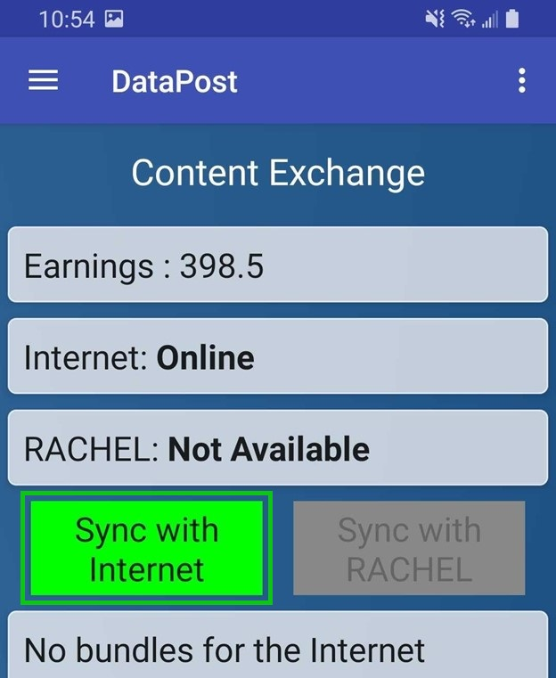
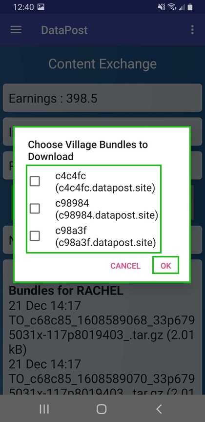
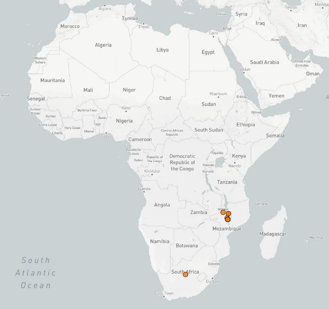

.. _useDataPost:

How to Use DataPost
==================

Following the steps in this guide will teach you to use the DataPost

*************
Prerequisites

To accomplish this task, you will need:

* RACHEL-Plus Device (RACHEL OS Version 3.1.1 or Higher) with DataPost sticker
* Access to the Internet
* Android Device (Android 9.x or newer)
* A means of Travel

To use DataPost, follow these steps:

1.	Connect your android phone to the RACHEL Wi-Fi Signal

2.	Open the DataPost app on your android phone and press “Sync with RACHEL”

3.	Return with your android phone to a place with internet or data connectivity, open the DataPost app and click Sync with Internet

.. note::
    Your mail will now be delivered!
    
4.	While your android phone is connected to the internet, if you have access to any RACHEL devices that have data needs, they will appear in a list

5.	You can now deliver these mail bundles back to the original RACHEL-Plus device!

.. important::
    PLEASE DO NOT DOWNLOAD DATA IF YOU DO NOT INTEND TO DELIVER IT TO THE CORRECT RACHEL. DATA WILL BE LOST AND WILL NOT DELIVER TO THE WRONG RACHEL.
    
    Please note: When using the DataPost app to pick up a bundle of e-mails from the internet destined for RACHEL, the android phone user must first have picked up a bundle from RACHEL and delivered it to the Internet. This process ensures the android phone user at one point had physical access to the RACHEL device and can be trusted to carry e-mails.

DataPost will also upload usage data from your RACHEL device to a website where anyone can view key anonymous usage statistics from your device

https://datapost.site:4001/map.html

 
http://datapost.site:3010/single?subdomain=c9895f
 
.. image:: ../_resources/dp_ud_06_dataPostStatistics.jpg
