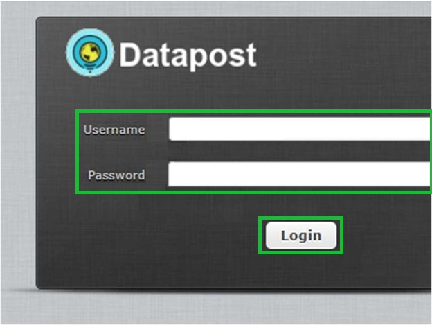

.. _usingWebmail:

How to Use Webmail
==================

Webmail is the Email service that is accessible through the RACHEL device and is used to send emails from one of the prebuilt email addresses to any valid email address on the internet whenever a courier delivers and retrieves a DataPost bundle.

*************
Prerequisites

To accomplish this task, you will need:

* RACHEL-Plus Device (RACHEL OS Version 3.1.1 or Higher) with DataPost sticker
* Device to Access the RACHEL Device (computer preferred)

To use RACHEL Webmail, follow these steps:

1. Connect to the RACHEL Device's Wi-Fi Network

2. Open a Web browser and navigate to RACHEL (192.168.88.1)

3. Select the Webmail button

4. At the login prompt enter the username/password as user1/password and press "login"

.. note::
    RACHEL is preloaded with 25 email accounts (user1, user2, ..., user25) all with the password of "password"

5. From DataPost webmail you can now compose and send an email to any email address on earth. If you are a project sponsor, you can send an e-mail to them from your Gmail or any other email service you use
6. The end of your email address (the domain) is assigned by RACHEL device using a six-digit code that matches the RACHEL MAC ID. For instance, user1@AB12CD.datapost.site where AB12CD changes based on each RACHEL device
7. To compose a new email, Select the Compose button

8. Input your webmail address into the From field

9. Input the email address you are sending this message to in the To field

10. Input the subject of the email in the Subject field

11. Write your message in the message box

12. When all the info is corrent and the message is ready to send, press the Send button and you're done!