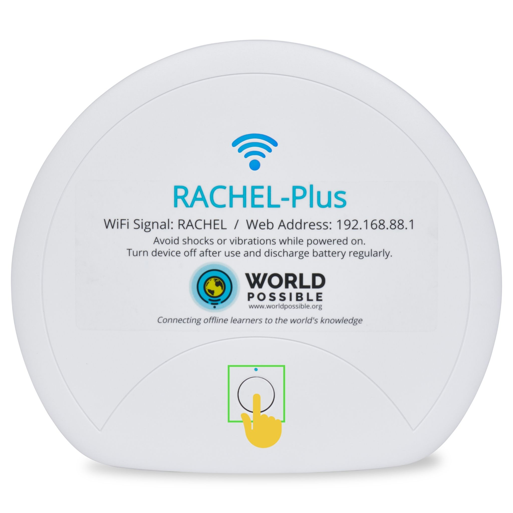
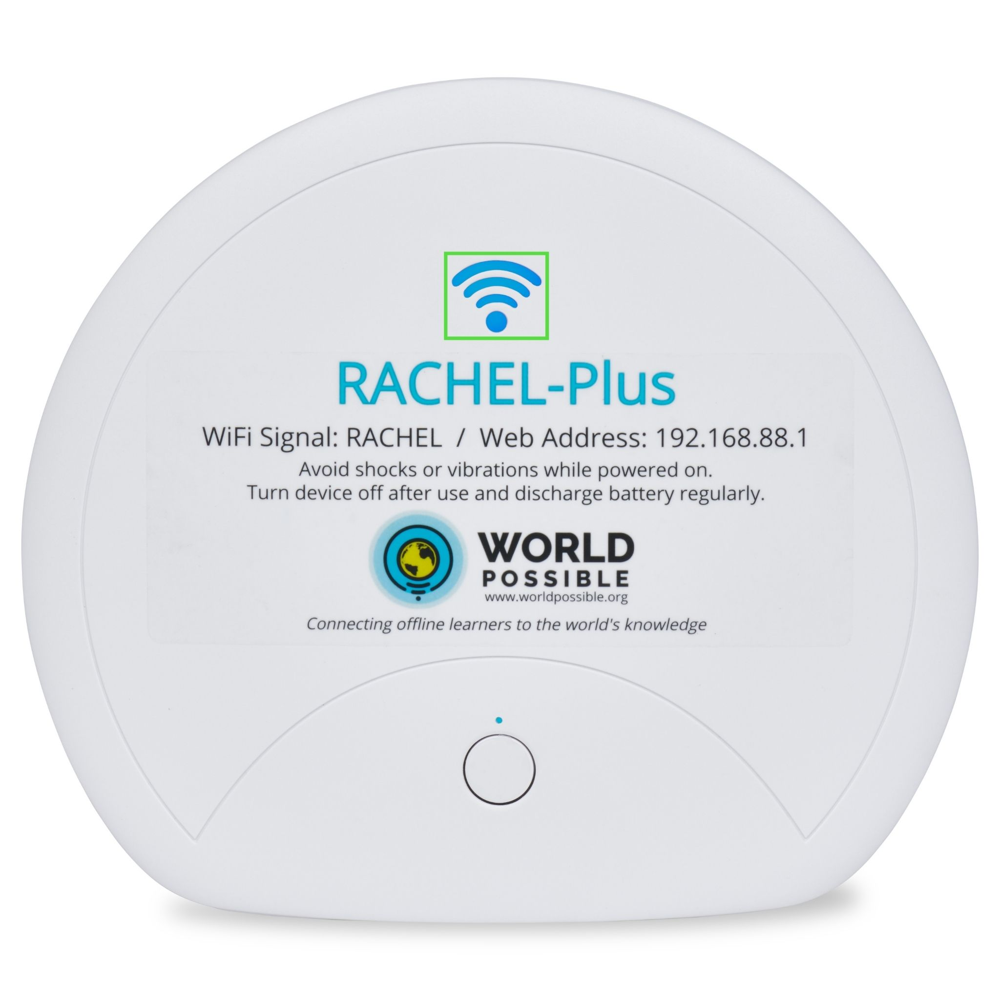

.. _powering_on:

Powering On the RACHEL-Plus Device
==================================

This guide will help you learn the proper way to turn on the RACHEL-Plus Device

*************
Prerequisites

To accomplish this task, you will need:

* RACHEL-Plus Device

To turn on the RACHEL-Plus Device, follow these steps:

1. Push and hold down RACHEL’s on button for 10 seconds or until the blue dot turns on.

2. The small blue dot will illuminate for 30 seconds until RACHEL activates.

 
3. When booted, RACHEL’s Wi-Fi signal light will flash slowly, you can now connect to the RACHEL wireless signal from your computer. It can take 3 minutes after flashing for all content to be ready!

