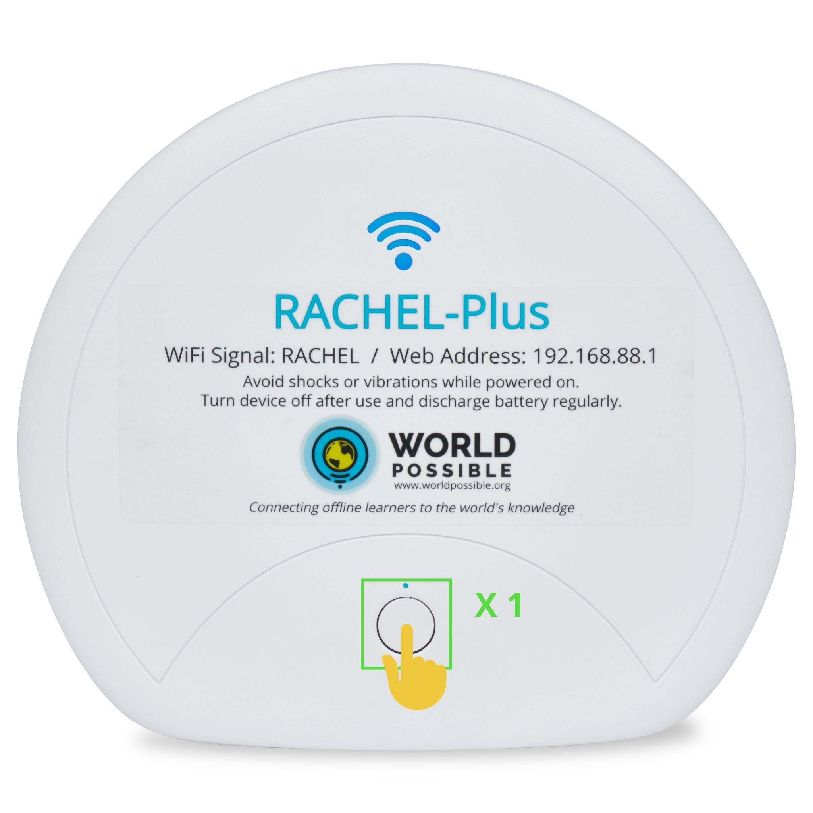

.. _shutting_down:

Shutting Off the RACHEL-Plus Device
===================================

This guide will help you learn the proper way to turn off the RACHEL-Plus Device

*************
Prerequisites

To accomplish this task, you will need:

* RACHEL-Plus Device

To turn off the RACHEL-Plus Device, follow these steps:

1. To properly power down the device, simply tap the power button 1 time and immediately release.

2. The RACHEL-Plus may take a few moments to fully power down but powering it down this way will ensure the longevity of the device.
