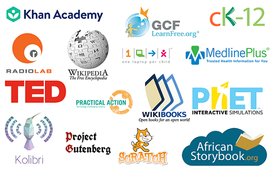

RACHEL User Guide
=================

RACHEL (Remote Area Community Hotspot for Education and Learning) is a portable, battery-powered, device that contains copies of educational websites in offline format. This means RACHEL can go anywhere in the world and wirelessly deliver free digital educational content to nearby tablets, laptops, or smartphones with no internet or data plans required. RACHEL has been taken to over 53 countries since its creation, serving students in rural villages, townships, and even prisons.

Content on RACHEL is specifically curated to serve the needs of offline populations in developing countries. RACHEL is the perfect way to connect learners with the information they need. To learn more about RACHEL go to https://www.worldpossible.org/

.. toctree::
   :hidden:

   getting_started/index
   faq/index
   hardware/index
   software/index
   coach/index