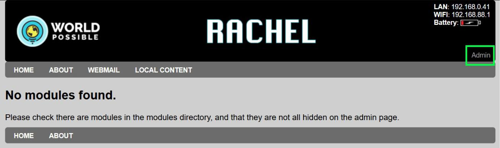

.. _en-file_share:

Uploading and Sharing Files
#################

This tutorial will guide you through uploading and sharing files using the en-file_share module

Installing en-file_share
========================

1. Click the “admin” button on the main page of RACHEL

2. The default username/password is admin/Rachel+1

3. Navigate to the “Install” tab

4. Select en-file_share and click “Download”, then wait for the module to install

5. Refresh the main page of RACHEL and you should now see the file share module

Uploading Files
===============

1. Click “Upload files” 

.. image:: ../_resources/fs_04_2_tutorial.png

2. On this screen you can drag and drop a file or click “Browse Files” to upload

3. Once the file has been uploaded you should see your file with a green “success”

3. On the main page of RACHEL, the click “View Files” to see the uploaded files.

4. You can either right click and save the file, or click them directly and save them

5. To hide the file share module from the main page when it’s not needed, First navigate to the “modules” tab in the admin interface

6. Click the “hide” checkbox on the right hand side for en-file_share, then click “Save Changes”

7. The module will now be hidden on the main page of RACHEL. To show it again, uncheck the hide button and click Save Changes again
