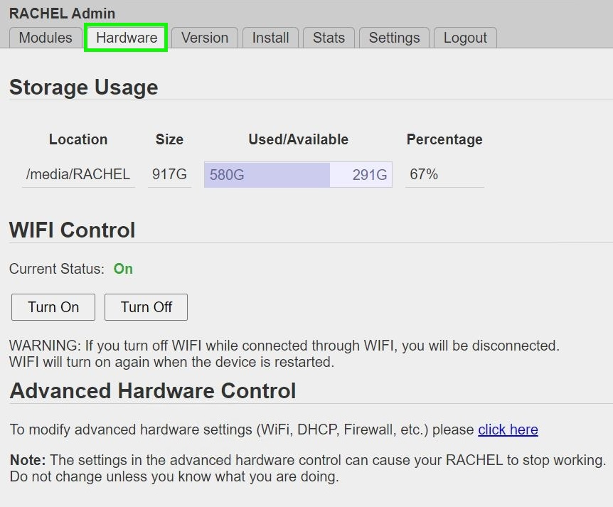
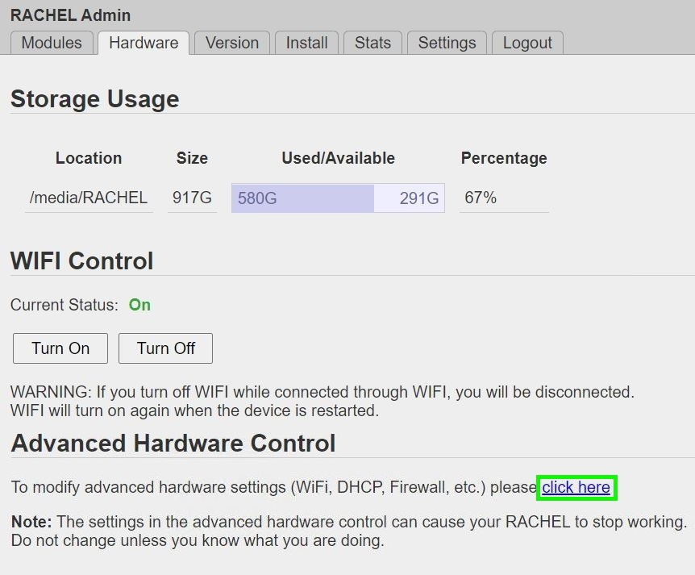
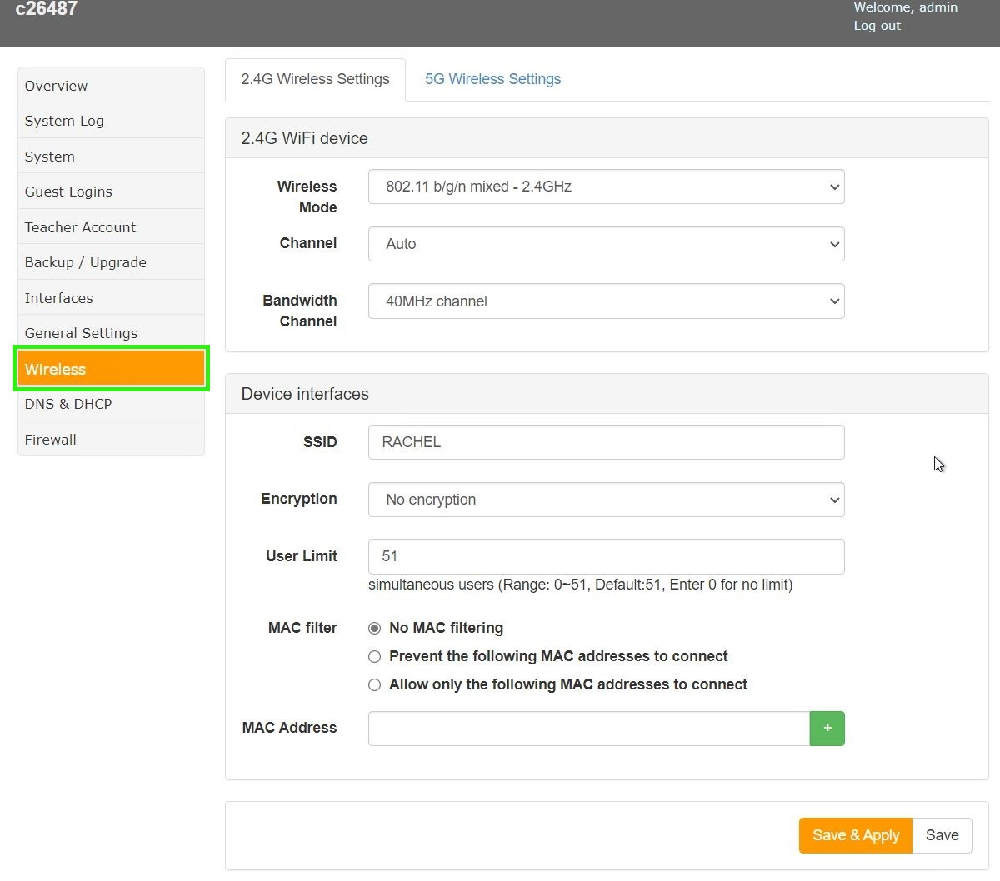
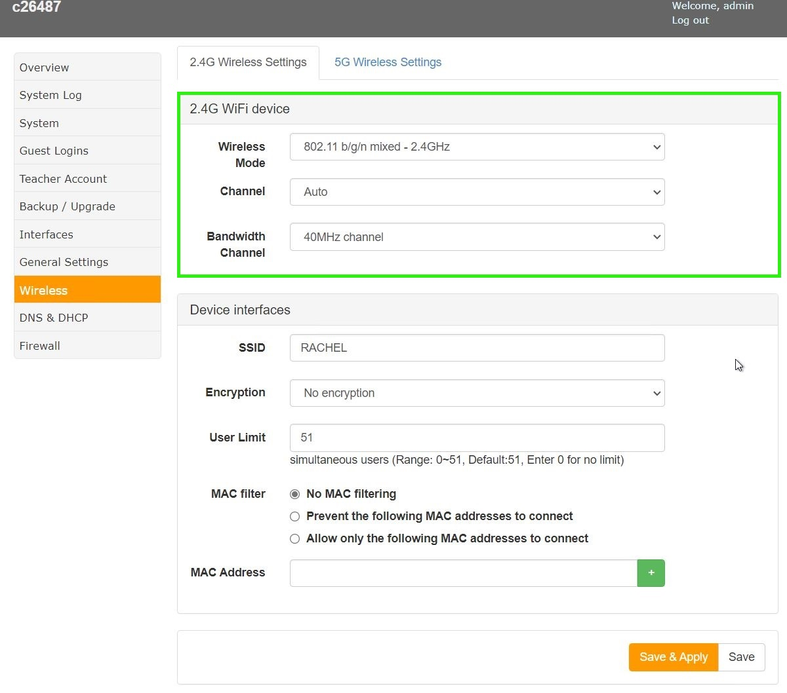
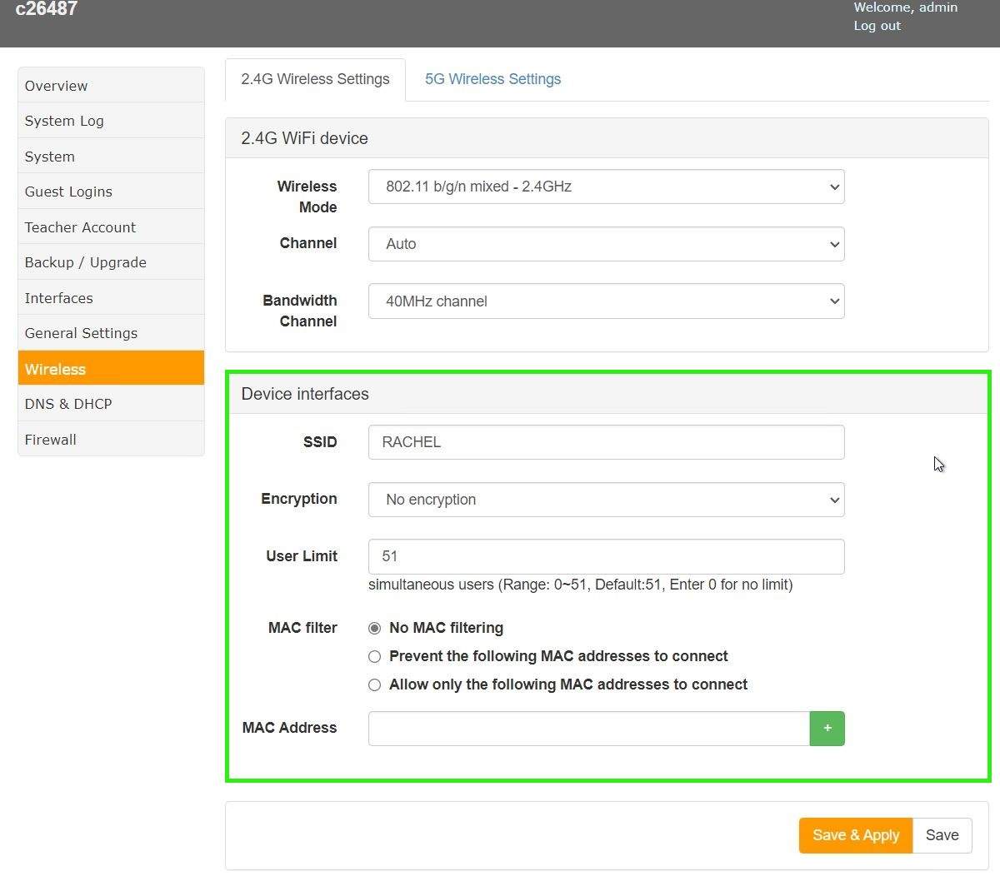
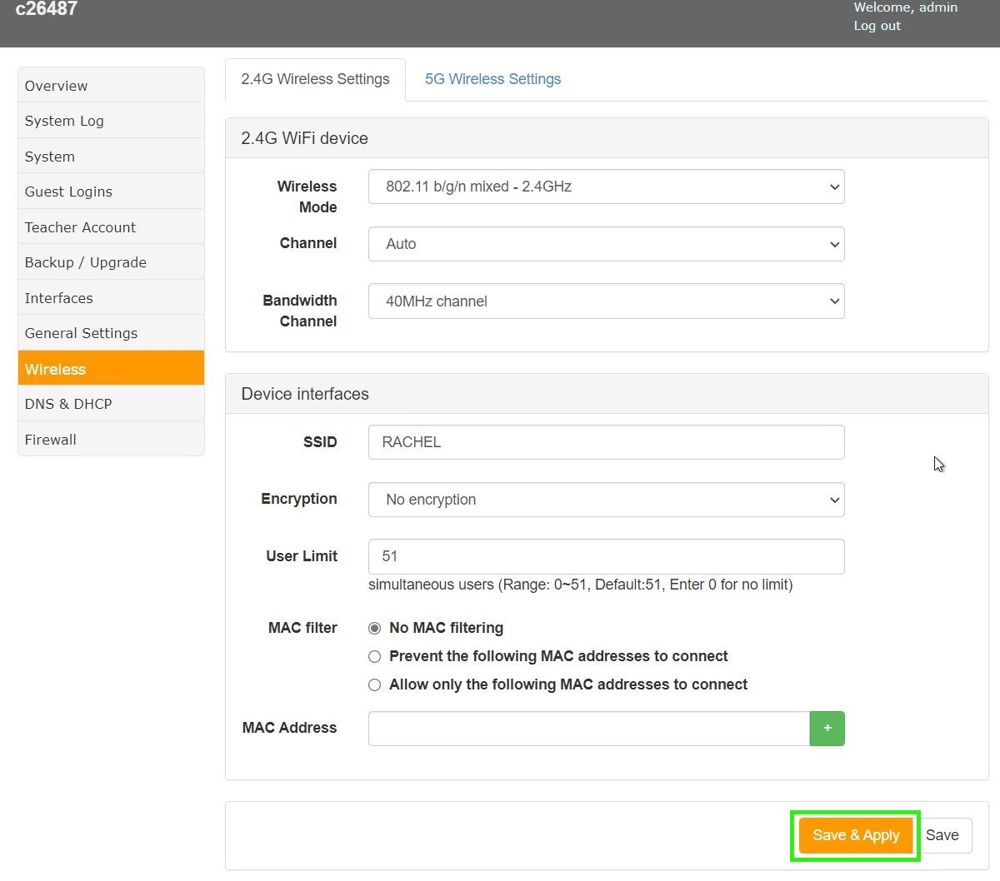

.. _hardware_controls:

Advanced Hardware Controls
##########################

This guide will show you how to use the Advanced Wireless Harware Tools in the RACHEL Server.

*************
prerequisites

To accomplish this task, you will need:

* A RACHEL-Plus
* A Device to access RACHEL (computer preferred)
* RACHEL Admin Credentials

To use RACHEL Server Advanced Wireless Hardware tools, follow these steps:

1. Access the RACHEL Admin Panel to view all the Admin Duty Tabs, Make sure the "Hardware" tab is selected

2. Click the Advanced Hardware Control link to access the Advanced Tools

3. On the left is a list of different Subject Tabs, Select the Wireless Tab

4. Wireless Mode, Channel, and Bandwidth Channel settings can all be changed in the Wifi Device settings pane

5. SSID, Encryption method, User Limit, and MAC Address settings can all be changed in the Device Interfaces pane

6. After changing any settings, make sure to select the "Save & Apply" button

