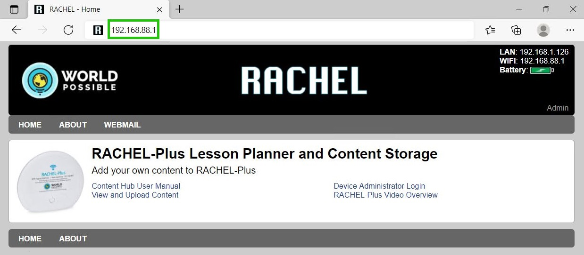
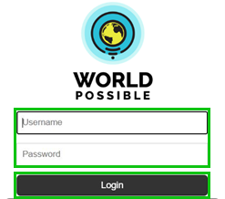

.. _accessing_admin_panel:

Accessing Admin Panel
=====================

This guide will show you how to nagivate to the RACHEL server and log into the Admin Panel

*************
prerequisites

To accomplish this task, you will need:

* A RACHEL-Plus
* A Device to access RACHEL (computer preferred)
* RACHEL Admin Credentials

To access the RACHEL server Admin Panel, follow these steps:

1. Power on the RACHEL-Plus device
2. Connect to the RACHEL Wi-Fi network

.. image:: ../../_resources/ad_ap_01_rachel-wifi.jpg
    :width: 50%

3. Open a web browser and navigate to the RACHEL server (192.168.88.1)

4. Select the Admin button

.. image:: ../../_resources/ad_ap_03_rachel_admin.png

5. Enter the RACHEL Server Admin Credentials 

