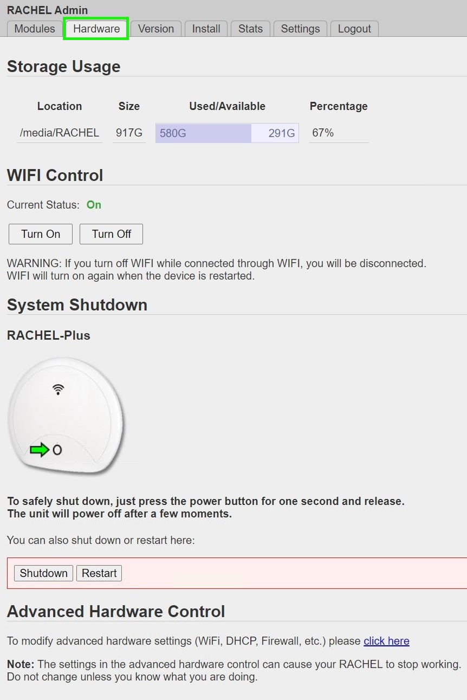
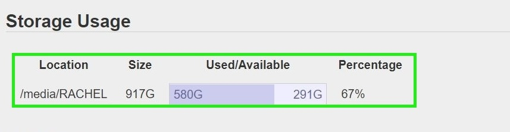
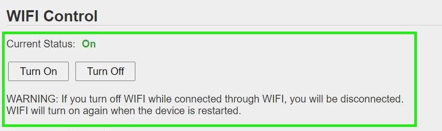
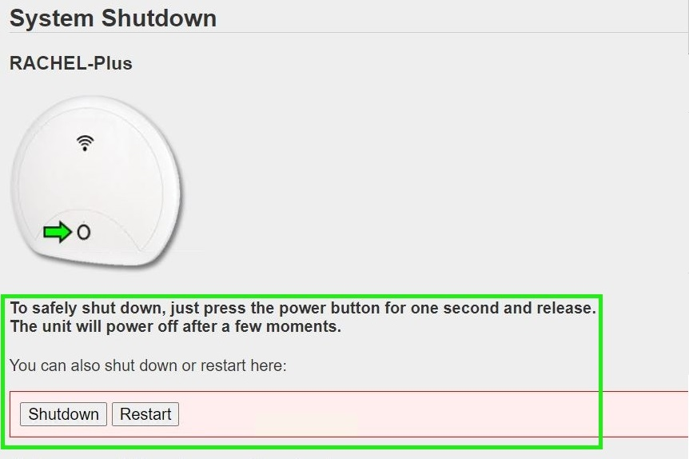
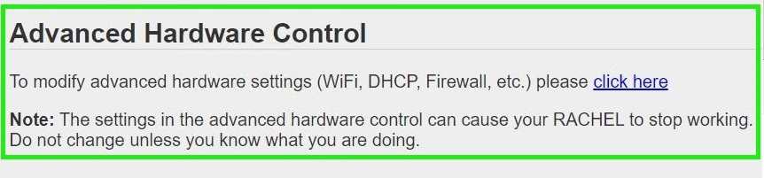

.. _hardware:

Managing RACHEL Hardware
========================

This guide will show you how to use the admin hardware tools for RACHEL

*************
prerequisites

To accomplish this task, you will need:

* A RACHEL-Plus
* A Device to access RACHEL (computer preferred)
* RACHEL Admin Credentials

To use RACHEL Server Hardware tools, follow these steps:

1. Access the RACHEL Admin Panel to view all the Admin Duty Tabs, Make sure the "Hardware" tab is selected

2. Storage Usage data is displayed at the top of the Hardware Tab

3. Below the Storage Usage data are the Wi-Fi controls which show you the RACHEL's Wi-Fi status and also provide buttons to turn it Off or On

4. Below the Wi-Fi controls are the RACHEL power controls, from here you can Shutdown the RACHEL or Restart it

5. Below the RACHEL power controls is the link to the Advanced Conrols, Click the link to access those tools.

